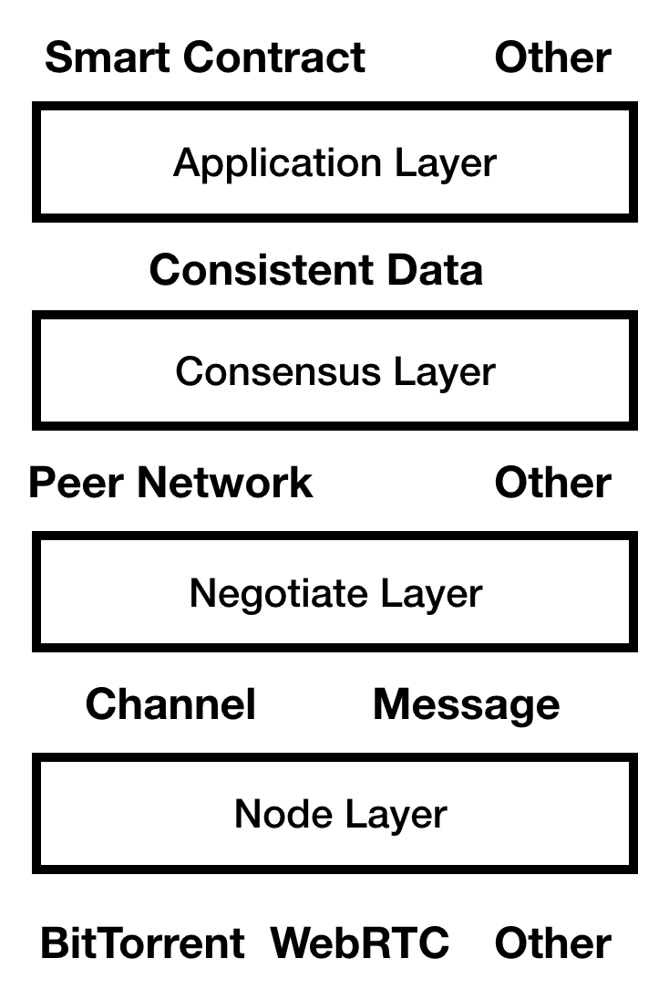

Design Of Basechain
===
Basechain is a project which aims at building blockchain and distributed system easily and rapidily. 
This repository contains documents describing the design and high-level overview of Basechain.

Basechain provides three tools:

- Basechain Network: Basechain Network is a blockchain and network. And you can deploy a smart contract or a chain contract here. A chain contract is a model file which contains how a new blockchain works. Anyone want to run it could start service and be rewarded according to the the chain contract.

- Base Framework: Base is a framework which helps you build blockchain. It parameterize and modularize the architecture of blockhain. 

- Gap Test Suite: Gap is a test enviroment for you to quickly verify your idea on distributed system. And it could help simulate processing data of your distributed system to tell you how your nodes changes.

### Guides

In the final goal, you can build and deploy your blockchain like the followings:

block(blk) is a tools of baseframework like node and bpm is blk package manager:

```
bpm init

```

And you will fill into basic information

- chainName
- version
- description
- author

Then It will create four folders in you project root directory.

```
.
├── chain.json
├── application
├── consensus
├── negotiate
└── node
└── environment
└── main.bc
```



You can config your code and function in the different layers which are different directories.


### Node Layer


In the node directory,  The main goal is to provide:


- Channel: Channel is an abstraction for establish a connection between two nodes, It has the followings:
  - Method: send
  - Event: data
  - Event: connected
  - Event: disconnected
- Message: Message is an abstraction of data. It contains:
  - headers
  - content
  - channel infomation

You can get some terms of P2P network such as:

- DHT:  neighborhood discovery 

- STUN: Traversal of UDP over NATs

And you may know the Channel is based on the neighborhood discovery techiniques and Messages if based on some transport techniques.

If you need a WebRTC to implement your P2P network, you could just:

```
cd node
bpm node get webrtc
```


And bpm will download the package and you blockchain could just run on the web browser and  It will be very interesting.


